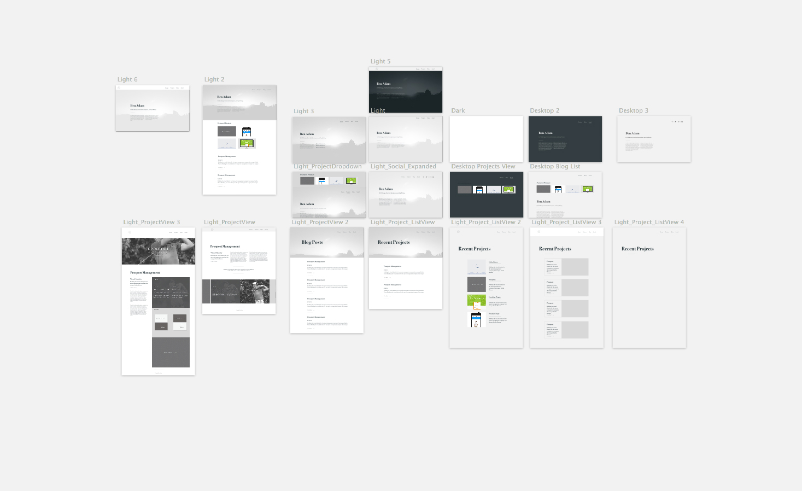

##The Design

I would not describe myself as having a very strong visual imagination.  In fact, my work at times feels like a struggle between what I see (or don't see) in my mind and my intuition and design sensibilities. 

Lately I have been very interested in editorial layouts.  I have the conviction
that good design cannot compensate for poor content, and in some cases gets in the way of good content.  I wanted my focus for this site to be its content.  

I started sketching out a few ideas for my site, and made some flow diagrams, but I ended up throwing them away.  I struggle with sketching (although I think it is an integral part of design) because I am slow and sloppy.  I am much more precise in a tool like Sketch or Illustrator. I can also iterate through bad ideas much quicker in these tools.

Inspired by sites like [Adam Kaplan's](http://www.adamkaplan.me) and [Daniel Eden's](http://www.daneden.me), I started iterating typography driven designs. I used 2 typefaces (Bodoni and Georgia) to set the typography hierarchy for the site.  I found that limiting myself to 2 typefaces was helpful (although doing it again I think I would have just picked one). 

After developing rough versions of the pages in Sketch, I jumped straight into building the site.

##The Technology

One of the goals I had for this project was to learn a new tool called [Docpad](http://www.docpad.org/). Essentially Docpad is a tool for building any type of web application.  It uses node.js to do the dirty work of compiling sass, coffeescript, and eco templates into static pages. Simply put ... it's amazing. You can see the source code for my site on [Github](https://github.com/benadam11/website).  

I build the page templates using Eco Templates (which is available to docpad via plugins).  The pages and posts contain YAML meta data which define the the template, and different data available to the page via eco.  Then the content of the page is written in Markdown, making it easy to manage content. 

Post and Project content is stored locally (rather than in a database) and docpad compiles static pages of the site which are deployed to your webserver. Ideally I would like to host my site on Github Pages, but unfortunately I still haven't solved some issues with the Ghpages plugin so that is on hold.  Currently, I am taking the contents of my 'out' directory and uploading via FTP to hostgator (gross I know...).  

Overall Docpad has blown me away with how easy it is to use, and how expendable it is. I am looking forward to using it on my upcoming dev projects.  

